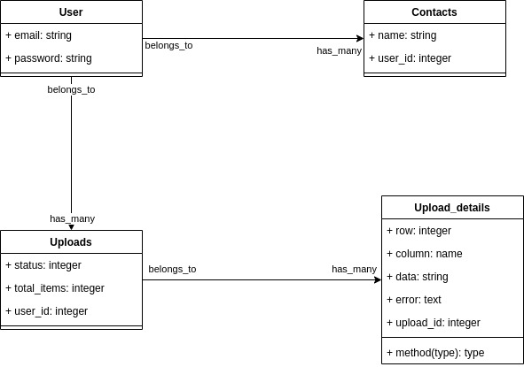

<p align="center">
    <h2 align="center"> Contacts Importer</h2>    
</p>


## Getting Started

This project was built using Ruby and Rails version 6, it is a web application and for running on your local environment you should follow these guidelines.


### Prerequisites

- Ruby 2.6.5
- Rails 6.0.3
- Git

### Class Diagram

We have the next relationship for out project

<br/>




### Setup

The project repository can be found in [GitHub link](https://github.com/rubenpazch/Group-our-transactions) or just clone the project using this command. 


```
Using SSH 

# git clone  https://github.com/rubenpazch/Group-our-transactions.git

Using HTTPS

# git clone  git@github.com:rubenpazch/Group-our-transactions.git

```

+ Open terminal on your workspace with

```
cd /home/workspace/Group-our-transactions
```


## Install


To get started with the app, clone the repo, and then install the needed gems:

```
# bundle install --without production
```

Next, migrate the database:

```
# rails db:migrate
```


```
$ rails server
```

### Usage

To watch the local version of this project check on your browser for the link 

```
Listening on tcp://127.0.0.1:3000
```

### Run tests

Run the test suite to verify that everything is working correctly:

```
# bundle exec rspec
```

If the test suite passes, you'll be ready to run the app in a local server:


### Deployment

To deploy to heroku first login in heroku

```
# heroku login
```

Create a new project in heroku

```
# heroku create
```

You can verify that the remote was added to your project by running:
```
# git config --list | grep heroku
# git push heroku master
```

Migrate your database
```
heroku run rake db:migrate
```

### Tools used on this project

- Visual Studio Code
- VSCode Ruby by Stafford Brunk
- Rubocop for Visual Studio Code
- Bootstrap 
- Rspec 
- Jquery
- Faker
- Factory Bot


<br/>

## Watch the Live Version


click on the link to watch [live version](https://morning-taiga-75196.herokuapp.com/)

<br/>


## Extra Feature

+ Click on the checkout button of the specific wishlist.
+ Proceed with the payment.
+ Notes.- After saving the payment the wishlist will disappear from the list


## Screenshots of the App


## Contributing

This project was created for educational purposes as part of the Microverse web development curriculum; contributing is not accepted.

Feel free to check the [issues page](https://github.com/rubenpazch/Group-our-transactions/issues).


## Authors

👤 **Ruben Paz Chuspe**

- Github: [@rubenpazch](https://github.com/rubenpazch)
- Linkedin: [rubenpch](https://www.linkedin.com/in/rubenpch/)
- Twitter: [@ChuspePaz](https://twitter.com/ChuspePaz)

### Show your support

Give a ⭐️ if you like this project!


## License

This project is licensed under the MIT License - see the [LICENSE.md](LICENSE.md) file for details

## Acknowledgments

* [Design idea by Gregoire Vella on Behance](https://www.behance.net/gregoirevella)
* [Creative Commons ](https://creativecommons.org/licenses/by-nc/4.0/)

